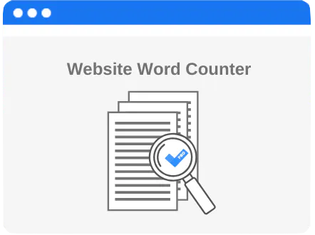

<div align="center">
  
  
  # 🔒 URL Word Counter
  
  **A Free & Open-Source Security Tool for Web Application URL Analysis**
  
  [](https://www.ruby-lang.org/)
  [](https://rubyonrails.org/)
  [](LICENSE)
  [](https://opensource.org/)
  
</div>

---

## 📋 Table of Contents

-   [Overview](#overview)
-   [Features](#features)
-   [Security Features](#security-features)
-   [Tech Stack](#tech-stack)
-   [Installation](#installation)
-   [Usage](#usage)
-   [API Documentation](#api-documentation)
-   [Architecture](#architecture)
-   [Contributing](#contributing)
-   [License](#license)

---

## 🎯 Overview

**URL Word Counter** is a powerful, free, and open-source security tool designed to assess and analyze website URLs for web application security. The platform provides comprehensive statistical analysis and insights about URL content while offering robust protection against type safety vulnerabilities and malware injection attacks.

Whether you're a security researcher, developer, or organization looking to enhance your web application security posture, URL Word Counter offers both a user-friendly web interface and a programmatic API for seamless integration into your security workflows.

### Key Benefits

-   ✅ **Free & Open Source** - No licensing fees, fully transparent codebase
-   ✅ **Security-Focused** - Built with web application security in mind
-   ✅ **Type-Safe Analysis** - Prevents common type-related vulnerabilities
-   ✅ **Malware Detection** - Identifies potential injection patterns
-   ✅ **RESTful API** - Easy integration with existing tools and workflows
-   ✅ **Real-Time Statistics** - Instant insights and analytics

---

## ✨ Features

### 🔍 URL Analysis & Statistics

-   **Word Frequency Analysis** - Top 25 most frequent words with occurrence counts
-   **Token Statistics** - Comprehensive token count, unique token analysis, and character metrics
-   **Content Insights** - Average characters per token, token density, and frequency distribution
-   **Real-Time Processing** - Fast, efficient analysis with lazy loading support

### 🛡️ Security Features

-   **Type Safety** - Strong parameter validation and type checking to prevent injection attacks
-   **Malware Detection** - Pattern recognition for suspicious content and potential threats
-   **Input Sanitization** - Robust input validation and sanitization mechanisms
-   **Secure Tokenization** - Safe text processing with configurable delimiters and separators

### 🚀 Developer Experience

-   **RESTful API** - Clean JSON API endpoints for programmatic access
-   **Friendly URLs** - SEO-friendly slugs using FriendlyId
-   **Modern UI** - Beautiful Bootstrap 5 interface with responsive design
-   **Turbo Rails** - Fast, seamless page updates without full reloads
-   **Stimulus** - Lightweight JavaScript framework for interactive components

---

## 🔐 Security Features

### Type Safety & Validation

URL Word Counter implements comprehensive type safety mechanisms to prevent common web vulnerabilities:

-   **Parameter Validation** - Strict parameter filtering using Rails strong parameters
-   **Input Type Checking** - Validates data types before processing
-   **Sanitization** - Cleans and normalizes input to prevent injection attacks

### Malware Injection Prevention

The platform includes advanced detection capabilities:

-   **Pattern Recognition** - Identifies suspicious patterns in URL content
-   **Token Analysis** - Analyzes token structures for potential threats
-   **Content Security Policy** - CSP headers for additional protection
-   **Safe Tokenization** - Secure text processing with regex-based validation

---

## 🛠️ Tech Stack

### Backend

-   **Ruby 3.0.0** - Modern, performant Ruby runtime
-   **Rails 7.0.4** - Latest Rails framework with Hotwire
-   **PostgreSQL** - Robust relational database
-   **Redis** - Caching and Action Cable support
-   **Puma** - High-performance web server

### Frontend

-   **Bootstrap 5.2.1** - Modern CSS framework
-   **Stimulus 3.1.0** - Minimal JavaScript framework
-   **Turbo Rails 7.2.0** - Fast page updates
-   **Sass** - CSS preprocessing
-   **ESBuild** - Fast JavaScript bundling

### Key Gems

-   **FriendlyId 5.4.0** - SEO-friendly URLs
-   **Words Counted 1.0.2** - Advanced text analysis and tokenization
-   **JBuilder** - JSON API responses

---

## 📦 Installation

### Prerequisites

-   Ruby 3.0.0 or higher
-   PostgreSQL 12+ (with server running)
-   Redis (for Action Cable)
-   Node.js 16+ and Yarn (for asset compilation)
-   Bundler gem

### Step-by-Step Setup

1. **Clone the repository**

    ```bash
    git clone https://github.com/yourusername/url-word-counter.git
    cd url-word-counter
    ```

2. **Install Ruby dependencies**

    ```bash
    bundle install
    ```

3. **Install JavaScript dependencies**

    ```bash
    yarn install
    ```

4. **Set up the database**

    ```bash
    bin/rails db:create
    bin/rails db:migrate
    ```

5. **Seed the database (optional)**

    ```bash
    bin/rails db:seed
    ```

6. **Start Redis server** (if not running)

    ```bash
    redis-server
    ```

7. **Start the Rails server**

    ```bash
    bin/rails s
    ```

    Or use the Procfile for development:

    ```bash
    bin/dev
    ```

8. **Access the application**

    Open your browser and navigate to `http://localhost:3000`

---

## 💻 Usage

### Web Interface

1. **Create a New Analysis**

    - Navigate to the home page
    - Click "New post" to create a new URL analysis entry
    - Enter the URL title and content
    - Submit the form

2. **View Statistics**

    - Browse existing analyses on the index page
    - Click "Stats" button to view detailed word frequency analysis
    - View top 25 words with occurrence counts

3. **Manage Analyses**
    - Click "Show" to view full analysis details
    - Edit or delete analyses as needed

### Programmatic API Access

The application provides RESTful JSON API endpoints for programmatic access:

#### Get All Analyses

```bash
GET /posts.json
```

#### Get Specific Analysis

```bash
GET /posts/:id.json
```

#### Create New Analysis

```bash
POST /posts.json
Content-Type: application/json

{
  "post": {
    "title": "Example URL",
    "body": "Content to analyze..."
  }
}
```

#### Get Statistics

```bash
GET /posts/:post_id/stats
```

---

## 📚 API Documentation

### Endpoints

#### Posts Resource

| Method   | Endpoint     | Description            |
| -------- | ------------ | ---------------------- |
| `GET`    | `/posts`     | List all analyses      |
| `GET`    | `/posts/:id` | Show specific analysis |
| `POST`   | `/posts`     | Create new analysis    |
| `PATCH`  | `/posts/:id` | Update analysis        |
| `DELETE` | `/posts/:id` | Delete analysis        |

#### Statistics Resource

| Method | Endpoint                | Description             |
| ------ | ----------------------- | ----------------------- |
| `GET`  | `/posts/:post_id/stats` | Get analysis statistics |

### Response Format

#### Post Object

```json
{
    "id": 1,
    "title": "Example URL",
    "slug": "example-url",
    "body": "Content text...",
    "created_at": "2022-09-24T16:38:06.000Z",
    "updated_at": "2022-09-24T16:38:06.000Z",
    "url": "/posts/example-url.json"
}
```

#### Statistics Object

The statistics endpoint returns comprehensive analysis including:

-   Top 25 words with frequency counts
-   Token count
-   Unique token count
-   Character count
-   Average characters per token

---

## 🏗️ Architecture

### Models

#### Post Model

-   Stores URL analysis entries
-   Uses FriendlyId for SEO-friendly slugs
-   Validates title and body content

#### Stats Model

-   Extends `WordsCounted::Counter` for advanced text analysis
-   Provides tokenization and statistical analysis
-   Configurable delimiters and separators
-   Methods: `top()`, `summary()`, `tokenize()`

### Controllers

-   **PostsController** - Handles CRUD operations for analyses
-   **StatsController** - Processes and returns statistical data

### Key Features

-   **Tokenization** - Advanced text tokenization with configurable options
-   **Statistical Analysis** - Comprehensive word frequency and content metrics
-   **Type Safety** - Strong parameter validation throughout
-   **Security** - Input sanitization and validation

---

## 🤝 Contributing

Contributions are welcome! This is an open-source project, and we appreciate your help in making it better.

### How to Contribute

1. Fork the repository
2. Create a feature branch (`git checkout -b feature/amazing-feature`)
3. Commit your changes (`git commit -m 'Add some amazing feature'`)
4. Push to the branch (`git push origin feature/amazing-feature`)
5. Open a Pull Request

### Development Guidelines

-   Follow Ruby style guide conventions
-   Write tests for new features
-   Update documentation as needed
-   Ensure all tests pass before submitting PR

---

## 📄 License

This project is licensed under the MIT License - see the LICENSE file for details.

---

## 🙏 Acknowledgments

-   Built with [Ruby on Rails](https://rubyonrails.org/)
-   Uses [Words Counted](https://rubygems.org/gems/words_counted) for text analysis
-   Powered by [FriendlyId](https://rubygems.org/gems/friendly_id) for SEO-friendly URLs
-   UI components from [Bootstrap](https://getbootstrap.com/)

---

## 📞 Support

For issues, questions, or contributions, please open an issue on GitHub.

---

<div align="center">
  <p>Made with ❤️ for the open-source community</p>
  <p>⭐ Star this repo if you find it useful!</p>
</div>
